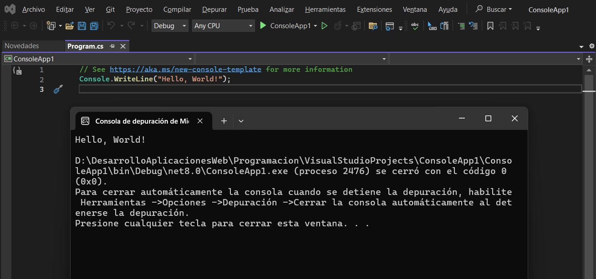
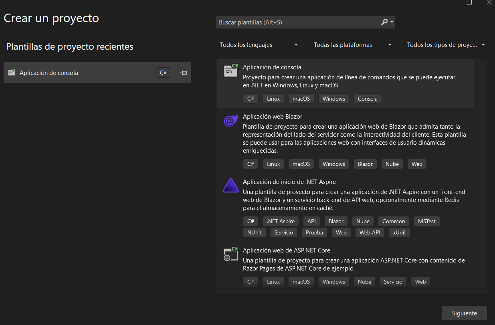
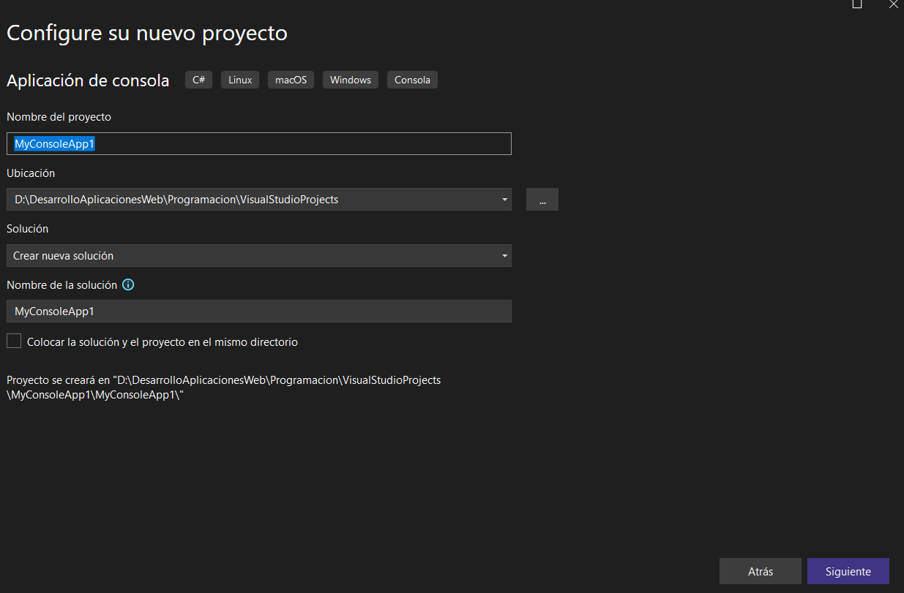
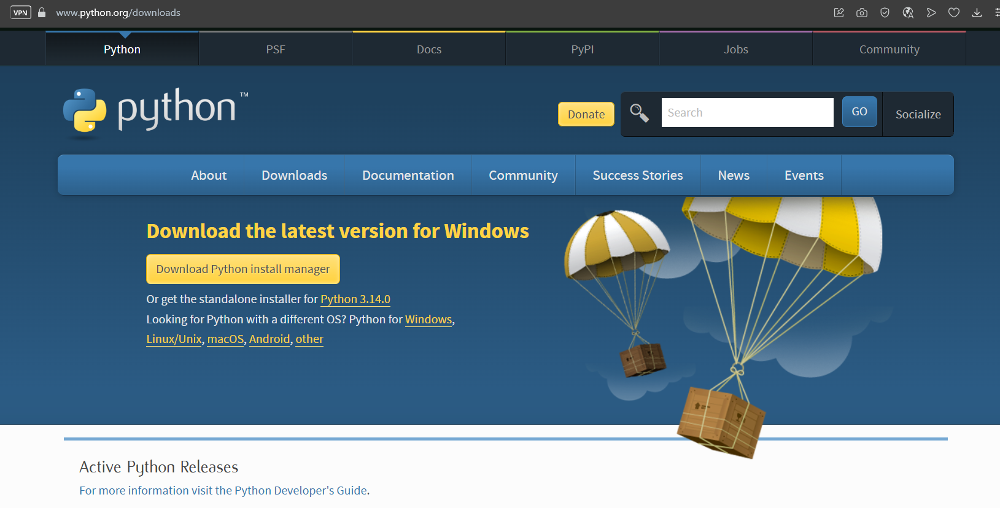
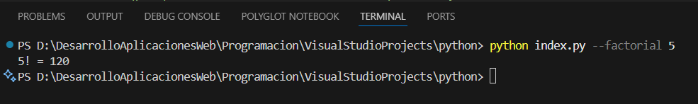

# Guía de Configuración de Entornos de Desarrollo

> 📋 **Guía Técnica**: Esta documentación establece los procedimientos para configurar un entorno de desarrollo en C# y otros lenguajes. Incluye las configuraciones necesarias para mantener consistencia en el desarrollo de software.

> **Nota importante**: Este documento se enfoca en aspectos técnicos y procedimientos. Para análisis comparativos, reflexiones personales y conclusiones, utiliza el archivo `CONCLUSIONES_EVALUACION.md`.

**Autores**: [Nicolas] y [Kevin]
**Fecha V0**: [Fecha de entrega inicial]
**Fecha V1**: [Fecha de entrega final]

---

## Visual Studio Code - Entorno Principal

### Instalación y Verificación

#  Método de Instalación de Visual Studio Code

## 1. Acceder al sitio oficial
Dirígete al sitio web oficial de Visual Studio Code:
[https://code.visualstudio.com](https://code.visualstudio.com)


---

## 2. Seleccionar el sistema operativo
Haz clic en el botón de descarga correspondiente a tu sistema operativo:

- **Windows**
- **macOS**
- **Linux**


---

## 3. Descargar el instalador
Esto dependiendo de tu sistema operativo, se descargará uno de los siguientes archivos:

- `.exe` para **Windows** *"En nuestro caso"*
- `.dmg` para **macOS**
- `.deb` o `.rpm` para **Linux**


---

## 4. Instalar Visual Studio Code

### Para Windows
1. Ejecuta el archivo `.exe`.
2. Acepta los términos de licencia.
- 
3. Elige la carpeta de instalación.
-  
4. Opcional: activa las opciones como:
   - "Agregar al PATH"
   - "Crear accesos directos"
- 
5. Haz clic en **Instalar**.
   
- 
6. Al finalizar, haz clic en **Finalizar** para abrir VS Code.
- 

---

### Para macOS
1. Abre el archivo `.dmg`.
2. Arrastra el ícono de **Visual Studio Code** a la carpeta **Aplicaciones**.
3. *(Opcional)* Para abrir VS Code desde la terminal:
   - Abre VS Code
   - Presiona `Cmd + Shift + P`
   - Escribe `Shell Command: Install 'code' command in PATH` y selecciona la opción.

---

### Para Linux

#### Para distribuciones Debian/Ubuntu (.deb)

1. Ejecuta el archivo `.deb` .
2. Abre una terminal en la carpeta donde descargaste el archivo y ejecuta:

    ```bash
    sudo dpkg -i code_versión_amd64.deb
    sudo apt-get install -f  # Para corregir dependencias si es necesario
    ```

    > Reemplaza `code_versión_amd64.deb` por el nombre real del archivo descargado, por ejemplo: `code_1.85.1-1702462158_amd64.deb`.

---

#### Para distribuciones Fedora/RHEL/CentOS (.rpm)

1. Ejecuta elarchivo `.rpm` descargado anteriomente.
2. Abre una terminal y ejecuta:

    ```bash
    sudo rpm -i code-versión.x86_64.rpm
    ```

   Si encuentras problemas de dependencias, puedes usar:

    ```bash
    sudo dnf install ./code-versión.x86_64.rpm
    ```

---

#### Usando Snap (disponible en muchas distribuciones)

### Si tienes Snap instalado:

```bash
sudo snap install code --classic
```

---

#### Usando Snap (disponible en muchas distribuciones)

Si tienes Snap instalado:

sudo snap install code --classic

### Uso Básico de VS Code

**Navegación y funcionalidades básicas:**
- Navegación por la interfaz
- Edición de código
- Uso de la paleta de comandos
- Gestión de archivos y carpetas

### Personalización del Entorno

**Configuraciones aplicadas:** [Describir las personalizaciones que se realizaron]

*Ejemplos de configuraciones útiles (elegir las que se consideren relevantes):*

**Temas e iconos:**
Ejemplos:
- Material Theme, One Dark Pro
- File Icon Theme para mejor identificación de archivos

**Configuración de fuentes:**
Ejemplos:
- Fira Code, JetBrains Mono (con ligaduras)

**Atajos de teclado útiles:**
Ejemplos:
- Ctrl+/ para comentar/descomentar
- Ctrl+Shift+P para paleta de comandos
- Ctrl+` para terminal integrada
- Alt+↑/↓ para mover líneas

**Configuración del editor:**
Ejemplos:
- Formateo automático al guardar
- Detección automática de indentación
- Word wrap para líneas largas

**Terminal integrada:**
Ejemplos:
- PowerShell como terminal predeterminado
- Configuración de perfil personalizado

> **Personaliza según tus necesidades**: Estas son sugerencias basadas en prácticas comunes. Experimenta y documenta las configuraciones que encuentres más útiles para tu flujo de trabajo.> 💼 **Manual de Incorporación**: Esta guía establece los estándares del equipo para configurar entornos de desarrollo en C#. Cualquier nuevo desarrollador debe poder seguir estas instrucciones para configurar su entorno de trabajo de manera consistente con el resto del equipo.

### SDK .NET

**Proceso de instalación:**
1. **Descarga e instalación:**
- Visitar la página [dotnet](https://dotnet.microsoft.com/download).


- Descargar el SDK de .NET.


- Ejecutar el istalador y seguir el asistente.


1. **Verificación:** [Cómo comprobar que funciona]
- Abrir el terminal y ejecutar: `dotnet --version`
- Debe mostrar la versión del SDK instalada


### Configuración para C#

**Extensiones esenciales:**
- **C# Dev Kit** (Microsoft): Proporciona IntelliSense, debugging, navegación de código y gestión de proyectos.
- **C#** (Microsoft): Extensión base con soporte del lenguaje.


**Configuraciones específicas para C#:** 
- **Formateo automático al guardar**: Extensión Prettier - Code formatter


- **IntelliSense mejorado**: Se activa automáticamente con C# Dev Kit
- **Detección del SDK**: C# Dev Kit detecta automáticamente el SDK instalado
- **Auto-guardado**: File -> Auto Save

**Debugging básico:**
- **Breakpoints**: Click en el margen izquierdo del editor (aparece punto rojo)
- **Ejecutar y depurar**: Presionar F5 o icono "Run and Debug"
- **Inspección**: Variables visibles en panel lateral, hover para ver valores en tiempo real


> **Enfoque práctico**: El SDK .NET + VS Code te permite compilar, ejecutar y depurar sin necesidad de Visual Studio completo.

### Flujo de Trabajo con C#

**Creación de proyectos:**
[Documentar el proceso para crear proyectos C#]

**Estructura de proyecto:**

- En el siguiente código 
```csharp
string ShowMessage(string name)
{
    return $"Hola {name}, Bienvenido";
}

Console.WriteLine(ShowMessage(args.Length > 0 ? args[0] : "Nombre1"));
Console.WriteLine(ShowMessage(args.Length > 1 ? args[1] : "Nombre2"));
```

**Compilación y ejecución:**
Para compilar y ejecutar el código, sigue estos pasos:

1. **Compilación:**
   - Abre el terminal integrado en VS Code (Ctrl + `).
   - Navega hasta la carpeta del proyecto.
   - Ejecuta el siguiente comando para compilar el código:
     ```
     dotnet build
     ```

2. **Ejecución:**
   - Después de compilar, ejecuta el siguiente comando para ejecutar el código:
     ```
     dotnet run
     ```
- **Terminal integrado:** Uso del terminal dentro de VS Code para comandos `dotnet`

**Debugging:**
- **Breakpoints:** Cómo establecer y usar puntos de interrupción
- **Inspección de variables:** Uso del panel de variables y hover para ver valores en tiempo real
- **Control de ejecución:** Continuar (F5), Step Over (F10), Step Into (F11), Step Out (Shift+F11)
- **Call Stack:** Navegación por la pila de llamadas durante la depuración
- **Watch:** Añadir expresiones para monitorear su valor durante la depuración
- **Console:** Uso de la consola de depuración para evaluar expresiones y ver salidas
- **Configuración de launch.json:** Personalización de configuraciones de depuración si es necesario
---

## Visual Studio - IDE Alternativo

### Instalación

**Proceso de instalación:**
- **Descarga:** Visita la página oficial https://visualstudio.microsoft.com/es/
Se recomienda la versión Community (gratuita) o Professional (si se dispone de licencia).


- **Componentes necesarios:** Durante la instalación, selecciona la carga de trabajo:
Desarrollo de escritorio con .NET (incluye C#, Windows Forms, WPF, .NET SDK, y compiladores).


- **Verificación:** 
  - Abre Visual Studio.
  - Crea un nuevo proyecto C# (por ejemplo, “Consola .NET”).
  - Si el proyecto compila y ejecuta correctamente (“Hello World”), la instalación fue exitosa.
 

### Desarrollo con C#

**Creación de proyecto:**
- Abrir Visual Studio
- Seleccionar "Crear un nuevo proyecto"
- Elegir "Aplicación de consola (.NET Core)" como tipo de proyecto
- Configurar el nombre y la ubicación del proyecto
- Hacer clic en "Crear"



**Flujo de trabajo básico:**
- **Escribir código:** Utiliza el editor para escribir tu código C#
- **Compilar:** Presiona `Ctrl + Shift + B` o selecciona "Compilar" en el menú
- **Ejecutar:** Presiona `F5` para ejecutar con depuración o `Ctrl + F5` para ejecutar sin depuración
- **Debugging:** Usa puntos de interrupción, inspección de variables y otras herramientas de depuración integradas

---

## Configuración de Lenguaje Adicional

**Lenguaje seleccionado:** Python
**Justificación:** Python es un lenguaje versátil y fácil de aprender, ideal para desarrollo rápido y prototipado.

### Instalación del Entorno

**Runtime/SDK:**
- **Descarga e instalación:** Visitar la página oficial https://www.python.org/downloads/


- **Verificación:**
  - Abrir terminal y ejecutar: `python --version` o `python3 --version`
  - Debe mostrar la versión instalada


### Configuración en VS Code

**Extensiones por lenguaje:**

*Para Java:*
- **Paquete completo de Java**: Incluye compilación, debugging y gestión de proyectos

*Para Python:*
- **Soporte oficial de Python**: Extensión completa con intérprete y debugging

*Para otros lenguajes:*
- Ejemplos:
  - JavaScript/TypeScript: "ESLint", "Prettier"
  - Go: "Go"
  - Ruby: "Ruby"
  - PHP: "PHP Intelephense"
  - Rust: "rust-analyzer"
  - Kotlin: "Kotlin Language"
  - Swift: "Swift for Visual Studio Code"
  - Dart: "Dart-Code"
  - R: "R Language"

**Configuraciones específicas aplicadas:**
- **Python:** Configuración del intérprete, formateo con Black, linting con Pylint
- **Java:** Configuración del JDK, formateo con Google Java Format
- **JavaScript/TypeScript:** Configuración de ESLint y Prettier
- **Go:** Configuración del GOPATH y formateo con gofmt
- **Ruby:** Configuración del intérprete y formateo con RuboCop
- **PHP:** Configuración del intérprete y formateo con PHP CS Fixer
- **Rust:** Configuración del toolchain y formateo con rustfmt
- **Kotlin:** Configuración del JDK y formateo con ktlint
- **Swift:** Configuración del toolchain y formateo con swift-format
- **Dart:** Configuración del SDK y formateo con dartfmt
- **R:** Configuración del intérprete y formateo con styler


### Proyecto de Ejemplo

**Código desarrollado:**
```python
import argparse
import sys
from pathlib import Path

#!/usr/bin/env python3
"""

Opciones:
    -h, --help        Mostrar ayuda
    --factorial N     Calcular factorial de N (entero >= 0)
    --wc FILE         Contar líneas, palabras y caracteres de FILE
"""


def factorial(n: int) -> int:
        if n < 0:
                raise ValueError("n debe ser >= 0")
        result = 1
        for i in range(2, n + 1):
                result *= i
        return result

def wc(path: Path):
        if not path.exists():
                raise FileNotFoundError(f"No existe el archivo: {path}")
        lines = words = chars = 0
        with path.open("r", encoding="utf-8") as f:
                for line in f:
                        lines += 1
                        chars += len(line)
                        words += len(line.split())
        return lines, words, chars

def parse_args():
        p = argparse.ArgumentParser(description="Ejemplos: factorial y conteo tipo wc")
        p.add_argument("--factorial", type=int, help="Calcular factorial de un entero >= 0")
        p.add_argument("--wc", type=Path, help="Contar líneas, palabras y caracteres de un archivo")
        return p.parse_args()

def main():
        args = parse_args()
        try:
                if args.factorial is not None:
                        n = args.factorial
                        print(f"{n}! = {factorial(n)}")
                elif args.wc is not None:
                        lines, words, chars = wc(args.wc)
                        print(f"{args.wc}: {lines} líneas, {words} palabras, {chars} caracteres")
                else:
                        print("Nada que hacer. Usa --help para ver las opciones.")
        except Exception as e:
                print("Error:", e, file=sys.stderr)
                sys.exit(1)

if __name__ == "__main__":
        main()

# Comentarios explicativos:
# - Este script es ejecutable desde la terminal (ej.: python index.py --factorial 5).
# - Implementa dos funciones de ejemplo:
#     * factorial(n): calcula el factorial de un entero no negativo.
#     * wc(path): devuelve el número de líneas, palabras y caracteres de un archivo de texto.
# - Usa argparse para parsear las opciones de la línea de comandos y Path para manejo de rutas.
# - Captura errores básicos (archivo no encontrado, argumentos inválidos) e imprime mensajes por stderr.

```

**Proceso de ejecución:**
```python
# Ejemplo de ejecución del script:
python index.py --factorial 5
# Salida esperada:
5! = 120s
```
**Capturas de pantalla del proyecto en VS Code:**


**Ejecución paso a paso**:
- Abrimos terminal con Ctrl+j
- Ejecutamos el comando `python index.py --factorial 5`

---

## Configuraciones Recomendadas

**Configuraciones generales:**
Ajustes recomendados para cualquier desarrollador que comience a trabajar con VS Code.

### 1.1 Formato y estilo de código
* Aplicar estándares de estilo:
    * **Python**: PEP 8
    * **JavaScript/TypeScript**: StandardJS, ESLint o Prettier
* Activar formateo al guardar:
    ```json
    "editor.formatOnSave": true
    ```
* Configurar linters necesarios:
    * **Python** → `flake8`, `pylint`, `black`
    * **JS/TS** → `eslint`, `prettier`

### 1.2 Automatización de pruebas
* Activar detección automática de tests:
    * **Python**: PyTest + extensión Python.
    * **JavaScript/TypeScript**: Jest o Vitest.
* Opcional: ejecutar pruebas al guardar usando extensiones como:
    * `Jest`
    * `Test Explorer UI`

### 1.3 Control de versiones (Git)
* Habilitar Git integrado:
    ```json
    "git.enableSmartCommit": true,
    "git.confirmSync": false
    ```
* Conectar repositorios con:
    * **GitHub**, **GitLab**, **Bitbucket**.
* Activar **GitLens** para obtener:
    * Autores por línea
    * Historial detallado
    * Comparaciones rápidas

### 1.4 Terminal integrada
* Configura el shell preferido:
    * **Linux/Mac**: `bash`, `zsh`, `fish`
    * **Windows**: `PowerShell`, `Git Bash`, `WSL`
* Ejemplo de configuración:
    ```json
    "terminal.integrated.defaultProfile.windows": "Git Bash"
    ```

### 1.5 Snippets personalizados
Útiles para acelerar tareas repetitivas:
* Crear snippets globales:
    * En VS Code → `File` > `Preferences` > `User Snippets`
* Ejemplos:
    * Plantilla para clases **Python**
    * Comandos básicos de consola
    * Boilerplate **HTML/CSS/JS**

### 1.6 Sincronización de configuraciones
* Usar **Settings Sync** integrado:
    * Sincroniza extensiones, configuraciones, atajos, snippets.
* Alternativa: extensiones como `Settings Sync v3`.

---

**Herramientas adicionales:**
Extensiones y utilidades CLI recomendadas según el stack.

### Extensiones recomendadas (generales)
* `Material Icon Theme`
* `VS Code IntelliSense`
* `GitLens`
* `Live Server`
* `Docker`
* `REST Client`

### Para Python
* **Extensiones**:
    * `Python` (Microsoft)
    * `Pylance`
    * `Black Formatter`
    * `Even Better TOML`
    * `Jupyter`
* **CLI recomendadas**:
    * `pipx`
    * `virtualenv`
    * `pytest`

### Para Web (HTML/CSS/JS)
* **Extensiones**:
    * `ESLint`
    * `Prettier`
    * `Auto Rename Tag`
    * `Path Intellisense`
    * `Tailwind CSS IntelliSense`
* **CLI recomendadas**:
    * `npm`, `npx`
    * `vite`
    * `eslint`, `prettier`

### Para Git / DevOps
* **Extensiones**:
    * `Git Graph`
    * `GitHub Pull Requests`
    * `Docker`
    * `Kubernetes`

---

**Solución de problemas comunes:**
### No se ejecuta el formateo al guardar
* Verifica:
    ```json
    "editor.formatOnSave": true,
    "[python]": { "editor.defaultFormatter": "ms-python.black-formatter" }
    ```

### Python no detecta el entorno virtual
* Selecciona intérprete:
    * VS Code → `Ctrl + Shift + P` → Buscar: **“Python: Select Interpreter”**

### Extensiones no funcionan
* Reinstalar extensión
* Verificar permisos del workspace
* Limpiar caché:
    * `Help` → `Toggle Developer Tools` → `Application` → `Clear Storage`

### Git no sincroniza
* Revisar configuración global:
    * `git config --global user.name`
    * `git config --global user.email`
* Revisar autenticación (Tokens, SSH).

### Terminal no abre o muestra errores
* Cambiar terminal por defecto:
    * `Configuración` → Buscar: **“Terminal > Default Profile”**

---
**Recursos útiles:**
### Documentación oficial
* [VS Code Docs: Guía completa](https://code.visualstudio.com/docs)
* [Python en VS Code: Integración con Python](https://code.visualstudio.com/docs/python/python-tutorial)
* [GitHub Docs: Uso de repositorios](https://docs.github.com/es)

### Guías recomendadas
* [PEP 8 Style Guide](https://peps.python.org/pep-0008/)
* [MDN Web Docs](https://developer.mozilla.org/es/docs/Web)
* [Git Book](https://git-scm.com/book/es/v2)

### Cursos y tutoriales
* Curso oficial de VS Code en YouTube
* Roadmap.sh
* FreeCodeCamp

---
