# Guía de Configuración de Entornos de Desarrollo

> 📋 **Guía Técnica**: Esta documentación establece los procedimientos para configurar un entorno de desarrollo en C# y otros lenguajes. Incluye las configuraciones necesarias para mantener consistencia en el desarrollo de software.

> **Nota importante**: Este documento se enfoca en aspectos técnicos y procedimientos. Para análisis comparativos, reflexiones personales y conclusiones, utiliza el archivo `CONCLUSIONES_EVALUACION.md`.

**Autores**: [Nicolas] y [Kevin]
**Fecha V0**: [Fecha de entrega inicial]
**Fecha V1**: [Fecha de entrega final]

---

## Visual Studio Code - Entorno Principal

### Instalación y Verificación

#  Método de Instalación de Visual Studio Code

## 1. Acceder al sitio oficial
Dirígete al sitio web oficial de Visual Studio Code:
[https://code.visualstudio.com](https://code.visualstudio.com)
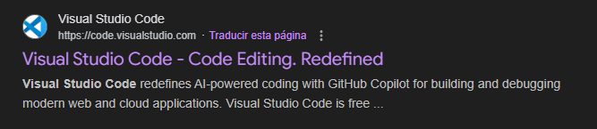

---

## 2. Seleccionar el sistema operativo
Haz clic en el botón de descarga correspondiente a tu sistema operativo:

- **Windows**
- **macOS**
- **Linux**

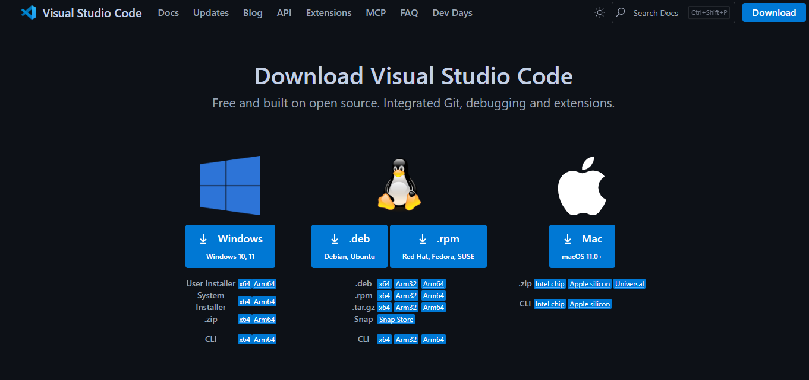

---

## 3. Descargar el instalador
Esto dependiendo de tu sistema operativo, se descargará uno de los siguientes archivos:

- `.exe` para **Windows** *"En nuestro caso"*
- `.dmg` para **macOS**
- `.deb` o `.rpm` para **Linux**

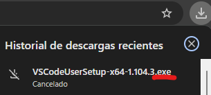

---

## 4. Instalar Visual Studio Code

### Para Windows
1. Ejecuta el archivo `.exe`.
2. Acepta los términos de licencia.
- 
3. Elige la carpeta de instalación.
- 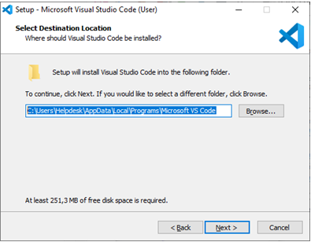 
4. Opcional: activa las opciones como:
   - "Agregar al PATH"
   - "Crear accesos directos"
- 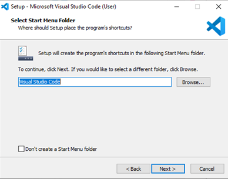
5. Haz clic en **Instalar**.
   
- 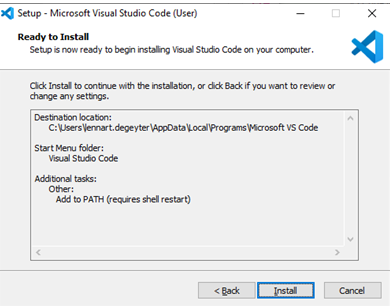
6. Al finalizar, haz clic en **Finalizar** para abrir VS Code.
- 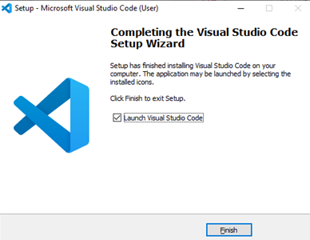

---

### Para macOS
1. Abre el archivo `.dmg`.
2. Arrastra el ícono de **Visual Studio Code** a la carpeta **Aplicaciones**.
3. *(Opcional)* Para abrir VS Code desde la terminal:
   - Abre VS Code
   - Presiona `Cmd + Shift + P`
   - Escribe `Shell Command: Install 'code' command in PATH` y selecciona la opción.

---

### Para Linux

#### Para distribuciones Debian/Ubuntu (.deb)

sudo dpkg -i nombre-del-archivo.deb
sudo apt-get install -f  # Para corregir dependencias si es necesario

### Uso Básico de VS Code

**Navegación y funcionalidades básicas:**
- Navegación por la interfaz
- Edición de código
- Uso de la paleta de comandos
- Gestión de archivos y carpetas

### Personalización del Entorno

**Configuraciones aplicadas:** [Describir las personalizaciones que se realizaron]

*Ejemplos de configuraciones útiles (elegir las que se consideren relevantes):*

**Temas e iconos:**
Ejemplos:
- Material Theme, One Dark Pro
- File Icon Theme para mejor identificación de archivos

**Configuración de fuentes:**
Ejemplos:
- Fira Code, JetBrains Mono (con ligaduras)

**Atajos de teclado útiles:**
Ejemplos:
- Ctrl+/ para comentar/descomentar
- Ctrl+Shift+P para paleta de comandos
- Ctrl+` para terminal integrada
- Alt+↑/↓ para mover líneas

**Configuración del editor:**
Ejemplos:
- Formateo automático al guardar
- Detección automática de indentación
- Word wrap para líneas largas

**Terminal integrada:**
Ejemplos:
- PowerShell como terminal predeterminado
- Configuración de perfil personalizado

> **Personaliza según tus necesidades**: Estas son sugerencias basadas en prácticas comunes. Experimenta y documenta las configuraciones que encuentres más útiles para tu flujo de trabajo.> 💼 **Manual de Incorporación**: Esta guía establece los estándares del equipo para configurar entornos de desarrollo en C#. Cualquier nuevo desarrollador debe poder seguir estas instrucciones para configurar su entorno de trabajo de manera consistente con el resto del equipo.

### SDK .NET

**Proceso de instalación:**
1. **Descarga e instalación:**
- Visitar la página [dotnet](https://dotnet.microsoft.com/download).

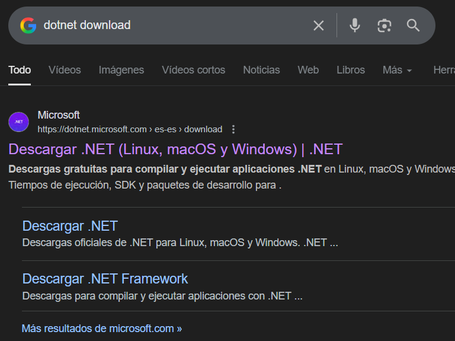
- Descargar el SDK de .NET.

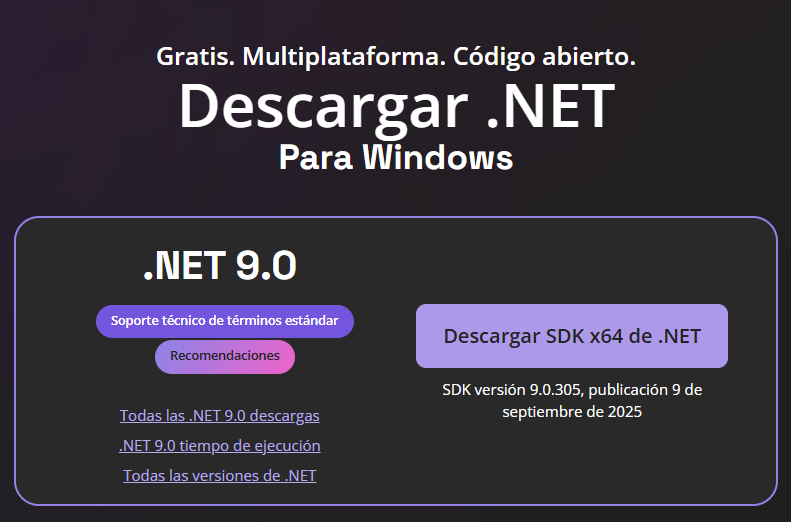
- Ejecutar el istalador y seguir el asistente.

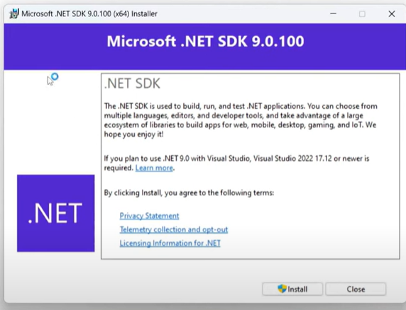

1. **Verificación:** [Cómo comprobar que funciona]
- Abrir el terminal y ejecutar: `dotnet --version`
- Debe mostrar la versión del SDK instalada

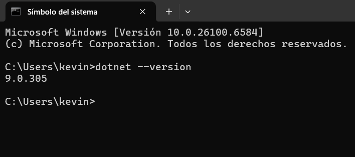

### Configuración para C#

**Extensiones esenciales:**
- **C# Dev Kit** (Microsoft): Proporciona IntelliSense, debugging, navegación de código y gestión de proyectos.
- **C#** (Microsoft): Extensión base con soporte del lenguaje.

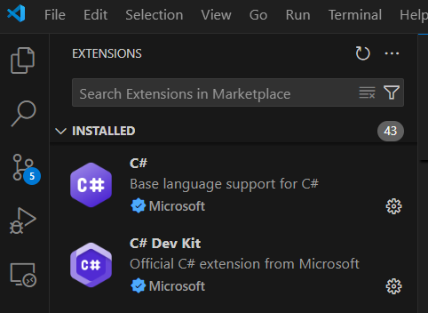

**Configuraciones específicas para C#:** 
- **Formateo automático al guardar**: Extensión Prettier - Code formatter

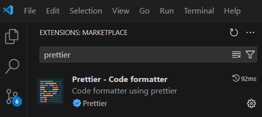
- **IntelliSense mejorado**: Se activa automáticamente con C# Dev Kit
- **Detección del SDK**: C# Dev Kit detecta automáticamente el SDK instalado
- **Auto-guardado**: File -> Auto Save

**Debugging básico:**
- **Breakpoints**: Click en el margen izquierdo del editor (aparece punto rojo)
- **Ejecutar y depurar**: Presionar F5 o icono "Run and Debug"
- **Inspección**: Variables visibles en panel lateral, hover para ver valores en tiempo real

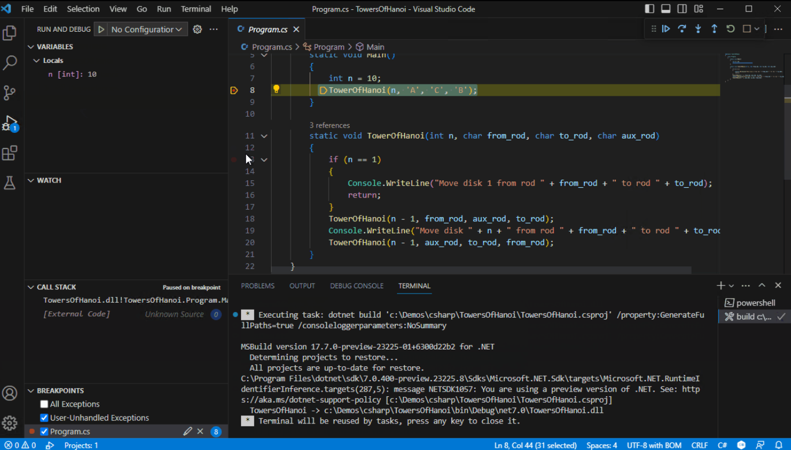

> **Enfoque práctico**: El SDK .NET + VS Code te permite compilar, ejecutar y depurar sin necesidad de Visual Studio completo.

### Flujo de Trabajo con C#

**Creación de proyectos:**
[Documentar el proceso para crear proyectos C#]

**Estructura de proyecto:**

- En el siguiente código 
```csharp
string ShowMessage(string name)
{
    return $"Hola {name}, Bienvenido";
}

Console.WriteLine(ShowMessage(args.Length > 0 ? args[0] : "Nombre1"));
Console.WriteLine(ShowMessage(args.Length > 1 ? args[1] : "Nombre2"));
```

**Compilación y ejecución:**
Para compilar y ejecutar el código, sigue estos pasos:

1. **Compilación:**
   - Abre el terminal integrado en VS Code (Ctrl + `).
   - Navega hasta la carpeta del proyecto.
   - Ejecuta el siguiente comando para compilar el código:
     ```
     dotnet build
     ```

2. **Ejecución:**
   - Después de compilar, ejecuta el siguiente comando para ejecutar el código:
     ```
     dotnet run
     ```
- **Terminal integrado:** Uso del terminal dentro de VS Code para comandos `dotnet`

**Debugging:**
- **Breakpoints:** Cómo establecer y usar puntos de interrupción
- **Inspección de variables:** Uso del panel de variables y hover para ver valores en tiempo real
- **Control de ejecución:** Continuar (F5), Step Over (F10), Step Into (F11), Step Out (Shift+F11)
- **Call Stack:** Navegación por la pila de llamadas durante la depuración
- **Watch:** Añadir expresiones para monitorear su valor durante la depuración
- **Console:** Uso de la consola de depuración para evaluar expresiones y ver salidas
- **Configuración de launch.json:** Personalización de configuraciones de depuración si es necesario
---

## Visual Studio - IDE Alternativo

### Instalación

**Proceso de instalación:**
- **Descarga:** Visita la página oficial https://visualstudio.microsoft.com/es/
Se recomienda la versión Community (gratuita) o Professional (si se dispone de licencia).

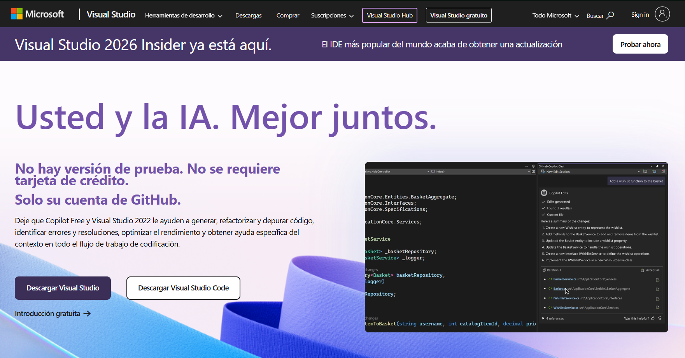
- **Componentes necesarios:** Durante la instalación, selecciona la carga de trabajo:
Desarrollo de escritorio con .NET (incluye C#, Windows Forms, WPF, .NET SDK, y compiladores).

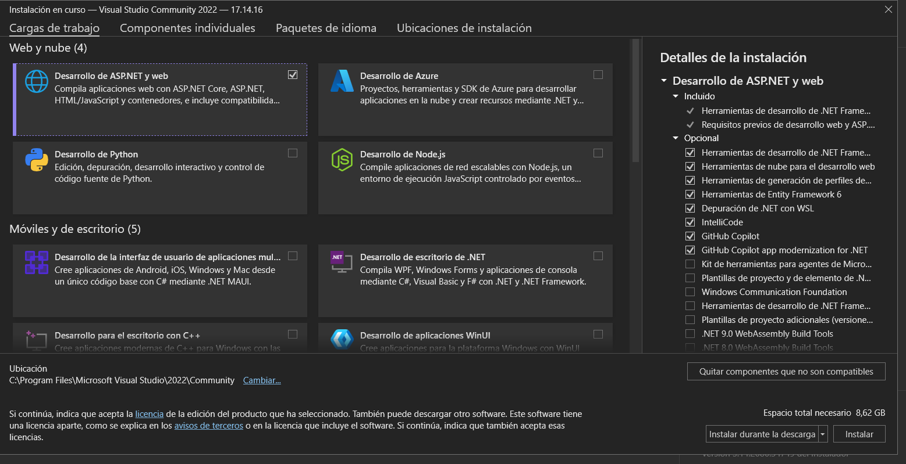
- **Verificación:** 
  - Abre Visual Studio.
  - Crea un nuevo proyecto C# (por ejemplo, “Consola .NET”).
  - Si el proyecto compila y ejecuta correctamente (“Hello World”), la instalación fue exitosa.
### Desarrollo con C#

**Creación de proyecto:**
[Describir el proceso para crear un proyecto C# en Visual Studio]

**Flujo de trabajo básico:**
- Compilación y ejecución
- Uso de Solution Explorer
- Debugging básico

---

## Configuración de Lenguaje Adicional

**Lenguaje seleccionado:** Python
**Justificación:** Python es un lenguaje versátil y fácil de aprender, ideal para desarrollo rápido y prototipado.

### Instalación del Entorno

**Runtime/SDK:**
- **Descarga e instalación:** Visitar la página oficial https://www.python.org/downloads/
- **Verificación:**
  - Abrir terminal y ejecutar: `python --version` o `python3 --version`
  - Debe mostrar la versión instalada

### Configuración en VS Code

**Extensiones por lenguaje:**

*Para Java:*
- **Paquete completo de Java**: Incluye compilación, debugging y gestión de proyectos

*Para Python:*
- **Soporte oficial de Python**: Extensión completa con intérprete y debugging

*Para otros lenguajes:*
- Busca la extensión oficial del lenguaje que proporcione soporte completo

**Configuraciones específicas aplicadas:**
[Documentar los ajustes que se realizaron, como configuración del intérprete, formateo automático, linting, etc.]

### Proyecto de Ejemplo

**Código desarrollado:**
```[lenguaje]
// Código de ejemplo aquí
// Comentarios explicativos
```

**Proceso de ejecución:**
[Describir cómo ejecutar el código]

---

## Configuraciones Recomendadas

**Configuraciones generales:**
[Documentar configuraciones que se consideran útiles para cualquier desarrollador]

**Herramientas adicionales:**
[Extensions, herramientas CLI, o utilidades que se consideran beneficiosas]

**Solución de problemas comunes:**
[Problemas frecuentes durante la configuración y sus soluciones]

**Recursos útiles:**
- Enlace [Enlace]: [Descripción]
- Documentación [Documentación]: [Descripción]

---
